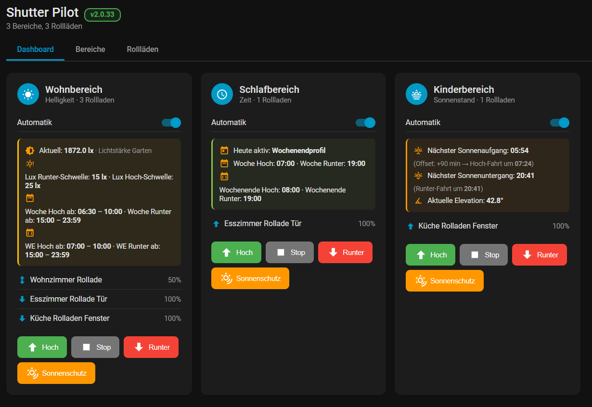
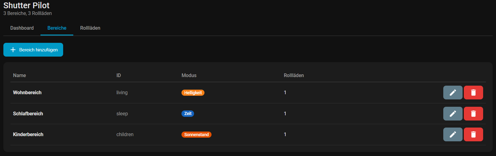
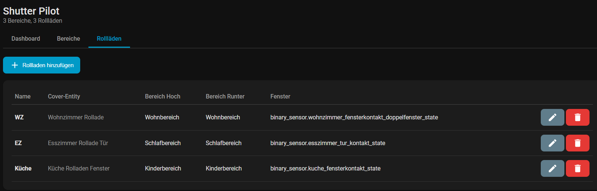

# Shutter Pilot

> **Automatische Rollladen-/Jalousiensteuerung für Home Assistant**

[English version](README.md)

---

Shutter Pilot ist eine Home Assistant Custom Integration, die Rollläden, Jalousien und Markisen automatisch steuert – basierend auf **Zeitplänen**, **Helligkeitssensoren** oder **Sonnenstand**. Die Integration bietet ein eigenes **Sidebar-Panel** für die komfortable Verwaltung direkt in Home Assistant.

## Funktionen

- **Drei Steuerungsmodi** pro Bereich: Zeitbasiert, helligkeitsbasiert (Lux-Sensor) oder Sonnenstand (Sonnenauf-/untergang)
- **Sidebar-Panel** mit Dashboard, Bereiche und Rollläden-Tabs zur vollständigen Verwaltung
- **Fenster-/Türsensoren** – öffnet Rollläden automatisch bei geöffnetem Fenster
- **Aussperrschutz** – verhindert vollständiges Schließen bei offener Tür
- **Sonnenschutz** – fährt Rollläden auf konfigurierbare Position wenn die Sonnenhöhe sinkt
- **Nachholfunktion** – holt geplante Fahrten nach, wenn das Fenster bei der Schließzeit noch offen war
- **Pro-Rollladen-Positionen** – konfigurierbare Offen-, Geschlossen- und Sonnenschutz-Positionen
- **Licht-Aktionen** – schaltet ein Licht/Schalter ein wenn Rollläden schließen
- **Auto-Modus-Schalter** – Automatik pro Bereich ein-/ausschalten über HA-Switches
- **Mehrsprachiges Panel** – passt sich automatisch an die HA-Sprache an (DE, EN, FR, ES, IT)
- **Wochentag-/Wochenend-Zeitpläne** – separate Zeitfenster für Wochentage und Wochenenden (Zeitmodus und Helligkeitsmodus)
- **Sonnenstand-Info im Dashboard** – zeigt nächsten Sonnenaufgang/-untergang, Offset und berechnete Trigger-Zeit für Sonnenstand-Bereiche

## Screenshots

Klicke auf ein Bild, um es auf GitHub in **voller Auflösung** zu öffnen (hier werden nur verkleinerte Vorschaubilder angezeigt).

  
  &nbsp;&nbsp;
  
  &nbsp;&nbsp;
  

  <b>Dashboard</b> · <b>Bereiche</b> · <b>Rollläden</b>

## Installation

### HACS (Empfohlen)

1. Öffne HACS in Home Assistant
2. Klicke auf das Drei-Punkte-Menü (oben rechts) → **Benutzerdefinierte Repositories**
3. Füge `https://github.com/fschubi/shutter_pilot` als **Integration** hinzu
4. Suche nach "Shutter Pilot" und installiere
5. Starte Home Assistant neu

### Manuell

1. Lade das neueste Release von [GitHub Releases](https://github.com/fschubi/shutter_pilot/releases) herunter
2. Kopiere den Ordner `custom_components/shutter_pilot` in dein HA `config/custom_components/` Verzeichnis
3. Starte Home Assistant neu

## Einrichtung

1. Gehe zu **Einstellungen → Geräte & Dienste → Integration hinzufügen**
2. Suche nach **Shutter Pilot** und klicke zum Hinzufügen
3. Nach der Einrichtung erscheint "Shutter Pilot" in der Seitenleiste

## Konfiguration

Die gesamte Konfiguration erfolgt über das **Shutter Pilot Sidebar-Panel**:

### Bereiche (Tab "Bereiche")

Klicke auf **"Bereich hinzufügen"** um einen neuen Bereich zu erstellen. Wähle einen Steuerungsmodus:

| Modus | Beschreibung |
|-------|-------------|
| **Zeit** | Rollläden fahren zu festen Zeiten hoch/runter mit separaten Wochentag-/Wochenend-Zeiten |
| **Helligkeit** | Gesteuert durch einen Lux-Sensor mit konfigurierbaren Schwellwerten und erlaubten Zeitfenstern |
| **Sonnenstand** | Nutzt Home Assistants Sonnenauf-/untergang-Tracking mit konfigurierbarem Offset |

Jeder Bereich kann zusätzlich haben:
- **Sonnenschutz** – fährt Rollläden auf eine Mittelposition wenn die Sonnenhöhe unter den Schwellwert fällt
- **Licht-Aktion** – schaltet ein Licht/Schalter ein wenn Rollläden schließen
- **Fahrverzögerung** – Sekunden zwischen einzelnen Rollläden (verhindert Sicherungsüberlastung)

### Rollläden (Tab "Rollläden")

Klicke auf **"Rollladen hinzufügen"** um eine Cover-Entity einem Bereich zuzuweisen:

- **Cover-Entity** – deine `cover.*` Entity
- **Fenstersensor** – optionaler `binary_sensor.*` für Fenster-Offen/Kipp-Erkennung
- **Bereich Hoch / Bereich Runter** – welcher Bereich diesen Rollladen für Hoch-/Runter-Fahrten steuert
- **Positions-Slider** – Offen-, Geschlossen- und Sonnenschutz-Positionen (0-100%)
- **Aussperrschutz** – Mindest-Position bei offener Tür (verhindert Aussperren)
- **Nachholfunktion** – holt einen verpassten Schließbefehl nach wenn das Fenster noch offen war

### Dashboard

Das Dashboard zeigt alle Bereiche als Karten mit:
- Aktuelle Rollladen-Positionen (live)
- Auto-Modus-Schalter pro Bereich
- **Sonnenstand-Info** für Sonnenstand-Bereiche: nächster Sonnenaufgang/-untergang, Offset, berechnete Trigger-Zeit, aktuelle Elevation
- Schnellaktions-Buttons: **Hoch**, **Stop**, **Runter**, **Sonnenschutz**

## Services

| Service | Beschreibung |
|---------|-------------|
| `shutter_pilot.open_group` | Alle Rollläden eines Bereichs öffnen |
| `shutter_pilot.close_group` | Alle Rollläden eines Bereichs schließen |
| `shutter_pilot.sun_protect_group` | Alle Rollläden eines Bereichs in Sonnenschutz-Position fahren |

Alle Services erwarten einen `area_id` Parameter (z.B. `living`, `schlafzimmer`).

## Unterstützte Sprachen

Das Shutter Pilot Panel passt sich automatisch an die Spracheinstellung deines Home Assistant an:

| Sprache | Code | |
|---------|:----:|---|
| Deutsch | `de` | :de: |
| English (Englisch) | `en` | :gb: |
| Français (Französisch) | `fr` | :fr: |
| Español (Spanisch) | `es` | :es: |
| Italiano (Italienisch) | `it` | :it: |
| Nederlands (Niederländisch) | `nl` | :netherlands: |
| Dansk (Dänisch) | `da` | :denmark: |
| Svenska (Schwedisch) | `sv` | :sweden: |
| Polski (Polnisch) | `pl` | :poland: |
| Português (Portugiesisch) | `pt` | :portugal: |
| Norsk Bokmål (Norwegisch) | `nb` | :norway: |

Wenn deine Sprache nicht aufgeführt ist, wird automatisch Englisch verwendet. Du möchtest eine Übersetzung beitragen? Pull Requests sind willkommen!

## Geplant: Markisen-Steuerung

> **Wir planen eine Markisen-Steuerung** mit Wind-, Regen- und Temperatursensoren als eigenen Tab. Markisen haben andere Anforderungen als Rollläden – sie müssen bei schlechtem Wetter eingefahren werden, um Schäden zu vermeiden.
>
> Geplante Funktionen: Windgeschwindigkeits-Sensor, Regensensor, Temperatur-Schwellwert, Wetterwarnungs-Integration (DWD, OpenWeatherMap), automatisches Einfahren bei gefährlichen Bedingungen.

**Würdest du diese Funktion nutzen? [Hier abstimmen!](https://github.com/fschubi/shutter_pilot/discussions/1)**

## Mindestanforderungen

- Home Assistant **2024.6.0** oder neuer

## Lizenz

Dieses Projekt ist Open Source. Siehe die [LICENSE](LICENSE) Datei für Details.
