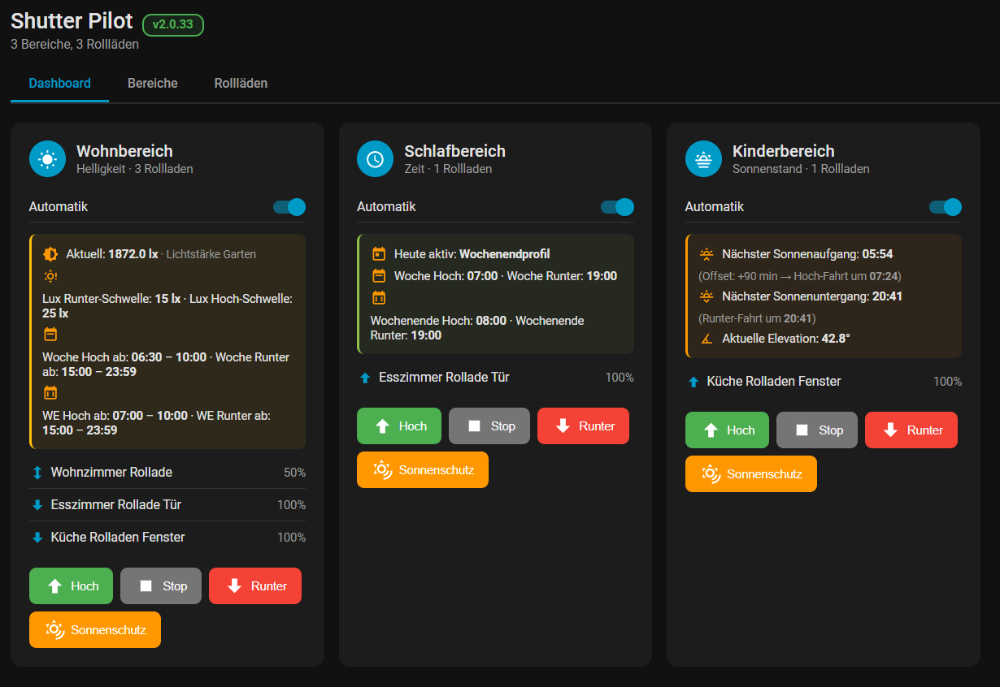
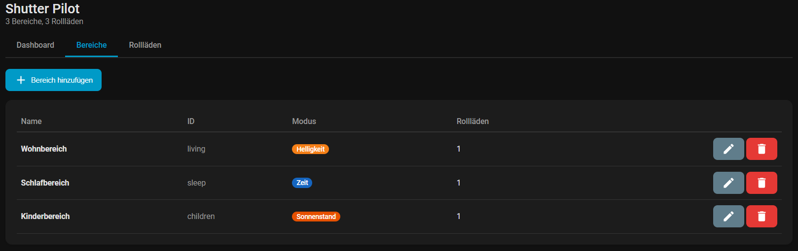
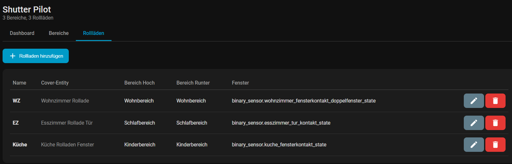

# Shutter Pilot

> **Automatische Rollladen-/Jalousiensteuerung für Home Assistant**

[](https://github.com/hacs/integration)
[](https://github.com/fschubi/shutter_pilot/releases)
[](LICENSE)
[](https://paypal.me/fschubi)

[English version](README.md)

---

Shutter Pilot ist eine Home Assistant Custom Integration, die Rollläden, Jalousien und Markisen automatisch steuert – basierend auf **Zeitplänen**, **Helligkeitssensoren** oder **Sonnenstand**. Die Integration bietet ein eigenes **Sidebar-Panel** für die komfortable Verwaltung direkt in Home Assistant.

## Funktionen

- **Drei Steuerungsmodi** pro Bereich: Zeitbasiert, helligkeitsbasiert (Lux-Sensor) oder Sonnenstand (Sonnenauf-/untergang)
- **Sidebar-Panel** mit Dashboard, Bereiche und Rollläden-Tabs zur vollständigen Verwaltung
- **Fenster-/Türsensoren** – öffnet Rollläden automatisch bei geöffnetem Fenster
- **Aussperrschutz** – verhindert vollständiges Schließen bei offener Tür
- **Sonnenschutz mit Himmelsrichtung** – beschattet nur, wenn die Sonne im eingestellten Höhenwinkel **und** vor den Fenstern steht
- **Nachholfunktion** – holt geplante Fahrten nach, wenn das Fenster bei der Schließzeit noch offen war
- **Pro-Rollladen-Positionen** – konfigurierbare Offen-, Geschlossen- und Sonnenschutz-Positionen
- **Lamellen-Steuerung** – optionaler Lamellenwinkel für Jalousien und Raffstores
- **Workday-Sensor** – Feiertage, Urlaub und Schichtarbeit statt starrer Samstag/Sonntag-Logik
- **Anwesenheitssimulation** – zufälliger Zeit-Offset von ±X Minuten
- **Licht-Aktionen** – schaltet ein Licht/Schalter ein wenn Rollläden schließen
- **Auto-Modus-Schalter** – Automatik pro Bereich ein-/ausschalten über HA-Switches
- **Eigene Entitäten** – nächste Fahrt und Sonnenschutz-Status als Sensoren für Dashboard und Automationen
- **Mehrsprachiges Panel** – passt sich automatisch an die HA-Sprache an (11 Sprachen)
- **Wochentag-/Wochenend-Zeitpläne** – separate Zeitfenster für Wochentage und Wochenenden (Zeitmodus und Helligkeitsmodus)
- **Sonnenstand-Info im Dashboard** – zeigt nächsten Sonnenaufgang/-untergang, Offset und berechnete Trigger-Zeit für Sonnenstand-Bereiche

## Screenshots

Klicke auf ein Bild, um es auf GitHub in **voller Auflösung** zu öffnen (hier werden nur verkleinerte Vorschaubilder angezeigt).

<p align="center">
  <a href="docs/screenshots/dashboard.png" title="Dashboard – Vollbild">
    
  </a>
  &nbsp;&nbsp;
  <a href="docs/screenshots/areas.png" title="Bereiche – Vollbild">
    
  </a>
  &nbsp;&nbsp;
  <a href="docs/screenshots/shutters.png" title="Rollläden – Vollbild">
    
  </a>
</p>

<p align="center">
  <b>Dashboard</b> · <b>Bereiche</b> · <b>Rollläden</b>
</p>

## Installation

### HACS (Empfohlen)

1. Öffne HACS in Home Assistant
2. Klicke auf das Drei-Punkte-Menü (oben rechts) → **Benutzerdefinierte Repositories**
3. Füge `https://github.com/fschubi/shutter_pilot` als **Integration** hinzu
4. Suche nach "Shutter Pilot" und installiere
5. Starte Home Assistant neu

### Manuell

1. Lade das neueste Release von [GitHub Releases](https://github.com/fschubi/shutter_pilot/releases) herunter
2. Kopiere den Ordner `custom_components/shutter_pilot` in dein HA `config/custom_components/` Verzeichnis
3. Starte Home Assistant neu

## Einrichtung

1. Gehe zu **Einstellungen → Geräte & Dienste → Integration hinzufügen**
2. Suche nach **Shutter Pilot** und klicke zum Hinzufügen
3. Nach der Einrichtung erscheint "Shutter Pilot" in der Seitenleiste

> **Hinweis:** Das Panel steht allen Benutzern in der Seitenleiste zur Verfügung, **konfigurieren kann es aber nur ein Administrator**. Ohne Administratorrechte zeigt das Panel das Dashboard mit den Bedienknöpfen (hoch, runter, stopp, Sonnenschutz, lüften); die Tabs für Bereiche, Rollläden und Einstellungen sowie der Hauptschalter und die Automatik-Schalter sind ausgeblendet. Alle ändernden Befehle werden zusätzlich serverseitig geprüft.

## Konfiguration

Die gesamte Konfiguration erfolgt über das **Shutter Pilot Sidebar-Panel**:

### Bereiche (Tab "Bereiche")

Klicke auf **"Bereich hinzufügen"** um einen neuen Bereich zu erstellen. Wähle einen Steuerungsmodus:

| Modus | Beschreibung |
|-------|-------------|
| **Zeit** | Rollläden fahren zu festen Zeiten hoch/runter mit separaten Wochentag-/Wochenend-Zeiten |
| **Helligkeit** | Gesteuert durch einen Lux-Sensor mit konfigurierbaren Schwellwerten und erlaubten Zeitfenstern |
| **Sonnenstand** | Nutzt Home Assistants Sonnenauf-/untergang-Tracking mit konfigurierbarem Offset |

Jeder Bereich kann zusätzlich haben:
- **Sonnenschutz** – fährt Rollläden auf eine Mittelposition, wenn die Sonne im eingestellten Höhenwinkel-Bereich **und** vor den Fenstern steht
- **Zusatzbedingungen für den Sonnenschutz** – bis zu zwei Sensoren, die zusätzlich erfüllt sein müssen (siehe unten)
- **Licht-Aktion** – schaltet ein Licht/Schalter ein wenn Rollläden schließen
- **Fahrverzögerung** – Sekunden zwischen einzelnen Rollläden (verhindert Sicherungsüberlastung)

### Rollläden (Tab "Rollläden")

Klicke auf **"Rollladen hinzufügen"** um eine Cover-Entity einem Bereich zuzuweisen:

- **Cover-Entity** – deine `cover.*` Entity
- **Fenstersensor** – optionaler `binary_sensor.*` für Fenster-Offen/Kipp-Erkennung
- **Zusätzlicher Sensor für „gekippt"** – nur nötig, wenn dein Fenster zwei getrennte Entitäten meldet, eine für offen und eine für gekippt. Bei einem Kontakt mit drei Zuständen bleibt das Feld leer
- **Bereich Hoch / Bereich Runter** – welcher Bereich diesen Rollladen für Hoch-/Runter-Fahrten steuert
- **Positions-Slider** – Offen-, Geschlossen- und Sonnenschutz-Positionen (0-100%)
- **Aussperrschutz** – Mindest-Position bei offener Tür (verhindert Aussperren)
- **Nachholfunktion** – holt einen verpassten Schließbefehl nach wenn das Fenster noch offen war

### Dashboard

Das Dashboard zeigt alle Bereiche als Karten mit:
- Aktuelle Rollladen-Positionen (live)
- Auto-Modus-Schalter pro Bereich
- **Sonnenstand-Info** für Sonnenstand-Bereiche: nächster Sonnenaufgang/-untergang, Offset, berechnete Trigger-Zeit, aktuelle Elevation
- Schnellaktions-Buttons: **Hoch**, **Stop**, **Runter**, **Sonnenschutz**

## Services

| Service | Beschreibung |
|---------|-------------|
| `shutter_pilot.open_group` | Alle Rollläden eines Bereichs öffnen |
| `shutter_pilot.close_group` | Alle Rollläden eines Bereichs schließen |
| `shutter_pilot.sun_protect_group` | Alle Rollläden eines Bereichs in Sonnenschutz-Position fahren |
| `shutter_pilot.ventilate_group` | Alle Rollläden eines Bereichs in die Lüftungsposition fahren |

Alle Services erwarten einen `area_id` Parameter (z.B. `living`, `schlafzimmer`). Jeder Rollladen fährt dabei auf seine eigene konfigurierte Position.

## Entitäten

Zusätzlich zum Panel legt Shutter Pilot Entitäten an, die du auf normalen Dashboards und in eigenen Automationen verwenden kannst:

| Entität | Beschreibung |
|---------|-------------|
| `switch.shutter_pilot_system` | Master-Schalter für die gesamte Automatik |
| `switch.shutter_pilot_auto_<bereich>` | Automatik pro Bereich |
| `sensor.shutter_pilot_<bereich>_nächste_fahrt` | Zeitstempel der nächsten geplanten Fahrt, Attribut `direction` = `up`/`down` |
| `binary_sensor.shutter_pilot_<bereich>_sonnenschutz` | `on`, solange die Beschattung aktiv ist |

## Event

Bei jeder automatischen Fahrt wird `shutter_pilot_cover_moved` auf dem Event-Bus gefeuert – ideal für eigene Benachrichtigungen:

```yaml
automation:
  - alias: Melden wenn Rollläden schließen
    trigger:
      - platform: event
        event_type: shutter_pilot_cover_moved
    condition: "{{ trigger.event.data.position < 20 }}"
    action:
      - service: notify.mobile_app
        data:
          message: >
            {{ trigger.event.data.entity_id }} auf
            {{ trigger.event.data.position }}% ({{ trigger.event.data.reason }})
```

Enthaltene Felder: `entity_id`, `position`, `tilt_position`, `reason`, `area_id`, `source`.

## Fehlersuche

Bei Problemen hilft der Diagnose-Download: **Einstellungen → Geräte & Dienste → Shutter Pilot → ⋮ → Diagnoseinformationen herunterladen**. Die Datei enthält Konfiguration, Laufzeitstatus und Sonnendaten – Standortkoordinaten werden geschwärzt.

## Unterstützte Sprachen

Das Shutter Pilot Panel passt sich automatisch an die Spracheinstellung deines Home Assistant an:

| Sprache | Code | |
|---------|:----:|---|
| Deutsch | `de` | :de: |
| English (Englisch) | `en` | :gb: |
| Français (Französisch) | `fr` | :fr: |
| Español (Spanisch) | `es` | :es: |
| Italiano (Italienisch) | `it` | :it: |
| Nederlands (Niederländisch) | `nl` | :netherlands: |
| Dansk (Dänisch) | `da` | :denmark: |
| Svenska (Schwedisch) | `sv` | :sweden: |
| Polski (Polnisch) | `pl` | :poland: |
| Português (Portugiesisch) | `pt` | :portugal: |
| Norsk Bokmål (Norwegisch) | `nb` | :norway: |

Wenn deine Sprache nicht aufgeführt ist, wird automatisch Englisch verwendet. Du möchtest eine Übersetzung beitragen? Pull Requests sind willkommen!

## Geplant: Markisen-Steuerung

> **Wir planen eine Markisen-Steuerung** mit Wind-, Regen- und Temperatursensoren als eigenen Tab. Markisen haben andere Anforderungen als Rollläden – sie müssen bei schlechtem Wetter eingefahren werden, um Schäden zu vermeiden.
>
> Geplante Funktionen: Windgeschwindigkeits-Sensor, Regensensor, Temperatur-Schwellwert, Wetterwarnungs-Integration (DWD, OpenWeatherMap), automatisches Einfahren bei gefährlichen Bedingungen.

**Würdest du diese Funktion nutzen? [Hier abstimmen!](https://github.com/fschubi/shutter_pilot/discussions/1)**

[](https://github.com/fschubi/shutter_pilot/discussions/1)

## Sonnenschutz nur bei echter Sonne und Wärme

Höhenwinkel und Himmelsrichtung sagen nur, **wo** die Sonne steht – nicht, ob sie tatsächlich scheint oder ob es überhaupt warm genug ist. Im Frühjahr und Herbst ist die Sonnenwärme im Zimmer ja oft erwünscht.

Deshalb lassen sich pro Bereich bis zu **zwei Zusatzbedingungen** hinterlegen. Beschattet wird nur, wenn alle erfüllt sind:

| Sensortyp | Verhalten |
|-----------|-----------|
| **Binärsensor** (z. B. „hohe Sonneneinstrahlung") | Beschattet, solange er `on` ist. Die Hysterese steckt in deinem Sensor |
| **Zahlensensor** (Lux, Watt/m², °C) | Beschattet ab „Beschatten ab", aufgehoben erst unter „Aufheben unter" |

Der Abstand zwischen den beiden Schwellen verhindert, dass die Rollläden bei durchziehenden Wolken ständig hin- und herfahren. Lässt du „Aufheben unter" leer, gilt derselbe Wert.

Ein leeres Feld bedeutet: keine Bedingung. Ein nicht verfügbarer oder defekter Sensor blockiert die Beschattung nie.

### Wetter und Vorhersage

Hinterlege im Tab **Einstellungen** deine `weather.*`-Entität. Shutter Pilot ruft dann selbst die Tagesvorhersage ab und stellt zwei Sensoren bereit:

| Sensor | Inhalt |
|--------|--------|
| Vorhersage Höchsttemperatur | erwarteter Tageshöchstwert |
| Vorhersage Wetterlage | erwartete Wetterlage, z. B. `sunny` |

Beide wählst du ganz normal als Bedingung aus. Typisch: **Vorhersage Höchsttemperatur, beschatten ab 24 °C**. Damit wird an kühlen Tagen nicht beschattet, und die Sonne wärmt das Haus.

Ein nicht erreichbares Wetter-Backend blockiert die Beschattung nie – der letzte bekannte Wert bleibt erhalten.

### Sensoren mit Textzustand

Bedingungen können auch **Zustände** vergleichen statt Zahlen. Damit lassen sich eine `weather.*`-Entität oder ein selbstgebauter Scrape-Sensor direkt eintragen: Du wählst einfach die Wetterlagen aus, bei denen beschattet werden soll. Bei Wetter-Entitäten stehen die Standardlagen als Schaltflächen bereit.

### Beschattungszeitraum

Pro Bereich lässt sich einstellen, in welchen Monaten überhaupt beschattet wird – etwa nur April bis September. Zeiträume über den Jahreswechsel sind möglich, z. B. Oktober bis März.

Meist erübrigt sich das durch eine Temperaturbedingung: Wenn die Vorhersage im Winter ohnehin unter der Schwelle bleibt, wird gar nicht erst beschattet.

### Sensoren pro Fenster statt pro Bereich

Bedingungen lassen sich sowohl im **Bereich** als auch am **einzelnen Rollladen** hinterlegen. Die Regel ist einfach:

> Der Bereich liefert den Standard. Was am Rollladen gesetzt ist, gilt für dieses Fenster.

Der Rückfall wirkt **je Bedingung**, nicht alles oder nichts. Typischer Aufbau:

- **Bereich:** Bedingung 1 = Vorhersage Höchsttemperatur ab 24 °C. Gilt für alle Fenster.
- **Südfenster:** Bedingung 2 = Helligkeitssensor am Südfenster.
- **Westfenster:** Bedingung 2 = Helligkeitssensor am Westfenster.

Beide Fenster erben die Temperaturbedingung und haben trotzdem ihren eigenen Helligkeitssensor. Genauso lässt sich eine Raumtemperatur pro Rollladen hinterlegen.

Jedes Fenster führt seine Hysterese getrennt – eine Wolke vor dem einen Fenster hebt die Beschattung des anderen nicht auf.

## Nach Sonnenstand fahren, aber nicht zu früh

Im Sonnenmodus lässt sich der berechnete Zeitpunkt in ein Uhrzeitfenster klemmen:

| Einstellung | Wirkung |
|---|---|
| Hoch frühestens 07:30 | Im Sommer geht die Sonne um 5 Uhr auf – gefahren wird trotzdem erst um 7:30 |
| Hoch spätestens 09:00 | Im Winter wird es erst spät hell – spätestens um 9 Uhr geht der Rollladen hoch |

Für das Wochenende gibt es eigene Werte. Bleiben die leer, gelten die Wochentagswerte. Leere Felder bedeuten generell: keine Grenze.

## Fahrten überprüfen

Funk-Rollläden verlieren gelegentlich einen Befehl. Ohne Kontrolle merkt das niemand, und die Integration rechnet danach mit einer Position weiter, die der Rollladen nie erreicht hat.

Im Tab **Einstellungen** lässt sich deshalb die Überprüfung aktivieren. Nach jeder automatischen Fahrt wird nach einer einstellbaren Wartezeit geprüft, ob die Position innerhalb der Toleranz erreicht wurde, und der Befehl sonst wiederholt.

Schlägt es endgültig fehl, wird der gespeicherte Wert korrigiert und das Ereignis `shutter_pilot_cover_failed` gefeuert – mit `entity_id`, `requested`, `actual` und `reason`. Damit lässt sich eine Benachrichtigung bauen:

```yaml
automation:
  - alias: Rollladen reagiert nicht
    trigger:
      - platform: event
        event_type: shutter_pilot_cover_failed
    action:
      - service: notify.mobile_app
        data:
          message: >
            {{ trigger.event.data.entity_id }} steht auf
            {{ trigger.event.data.actual }}% statt
            {{ trigger.event.data.requested }}%
```

Rollläden, die nur auf und zu kennen und keine Position melden, werden automatisch übersprungen.

## Räume mit Fenstern in mehreren Himmelsrichtungen

Höhenwinkel und Himmelsrichtung gelten normalerweise für den ganzen Bereich. Zeigt ein Fenster in eine andere Richtung als die übrigen im selben Raum, aktivierst du beim betreffenden Rollladen **Eigene Ausrichtung** und stellst dort Höhenwinkel und Azimut ein.

So werden Süd- und Westfenster desselben Raums zu unterschiedlichen Tageszeiten beschattet, ohne dass du zwei Bereiche mit doppeltem Zeitplan pflegen musst.

## Abends nur teilweise schließen

Sollen bestimmte Rollläden an heißen Abenden nicht ganz zufahren, um weiter zu lüften:

1. Im **Bereich** unter *Abweichendes Schliessen* eine Bedingung hinterlegen – etwa einen Sensor für Hitze und Anwesenheit
2. Bei den betreffenden **Rollläden** eine Teilposition setzen, z. B. 50 %

Nur Rollläden mit gesetzter Teilposition weichen ab, alle anderen schließen normal.

## Unterstützt mich

Shutter Pilot entsteht in meiner Freizeit und ist und bleibt kostenlos und quelloffen. Wenn dir die Integration den Alltag erleichtert und du dich erkenntlich zeigen möchtest, freue ich mich über einen Kaffee:

<a href="https://paypal.me/fschubi">
  
</a>

Genauso hilfreich und völlig kostenlos: einen ⭐ hierlassen, einen [Fehler melden](https://github.com/fschubi/shutter_pilot/issues) oder eine Übersetzung beisteuern.

## Mindestanforderungen

- Home Assistant **2024.6.0** oder neuer

## Lizenz

MIT – siehe die [LICENSE](LICENSE) Datei für Details.
